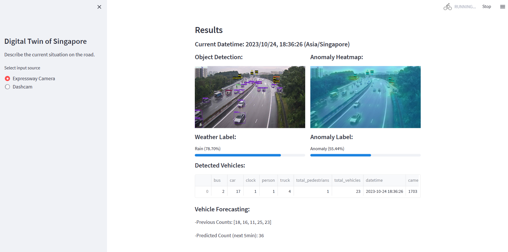

# EMIA-demo
 Standalone demo for EMIA

- The model is running *LIVE* at [Huggingface](https://huggingface.co/spaces/Interactive-Coventry/EMIA__demo).

- Base repo: [Github | Interactive-Coventry/EMIA__demo](https://github.com/Interactive-Coventry/EMIA__demo/)

  - To run with Streamlit:
    - Run in a terminal with `streamlit run .\app.py` and open `http://localhost:8501/` in your browser.
    - For custom port run with `streamlit run .\app.py --server.port 8531` and open `http://localhost:8531/` in your browser.

## How to run the demo with Streamlit in a browser with GUI
```
$ streamlit run .\app.py
```



## How to run from terminal with CLI (command line interface) tool
- Get insights for single image using history <br>
```
    $ python run_emia.py analyze "data\test\1703\1703_20230913183132.jpg" 5
```

- Test insights for single image using history <br>
```
    $ python test-app.py test 
```

- Get help <br>
```
    $ python test-app.py --help <br>
    $ python test-app.py analyze --help
    $ python test-app.py test --help
```

## For the config.ini file settings 

- device: cpu or cuda
- db_mode: local or streamlit or firebase

Details in config_files/

## For docker 
```
$ mkdir emia__demo
$ cd emia__demo
$ touch Dockerfile
```
- Check and copy into the Dockerfile, then 
```
$ docker system prune # Clean up , carefull because it cleans all 
$ docker build -t emia__demo . 
$ docker run -p 8531:8531 emia__demo 
```

If you get error ' Unable to fetch some archives, maybe run apt-get update or try with --fix-missing?' then use 
```
$ sudo apt-get clean
```
or use the --no-cache flag in the build command.
```
$ docker build --no-cache -t emia__demo . 
```